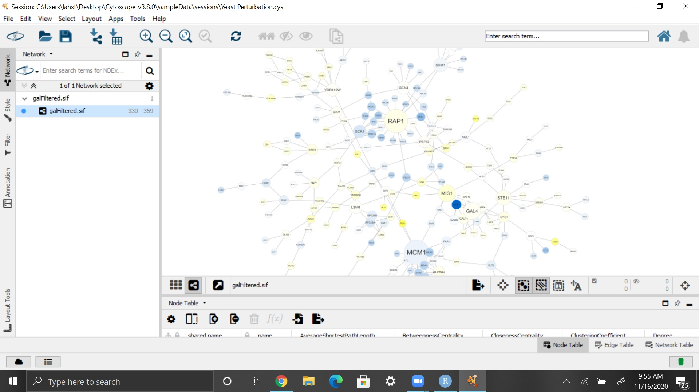
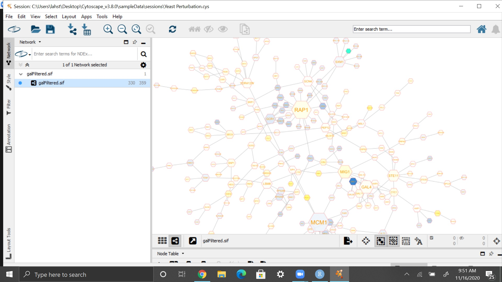
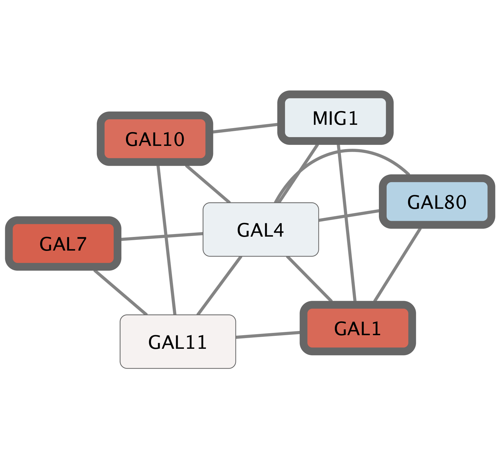

```{r setup, include=FALSE}
knitr::opts_chunk$set(echo = TRUE)
```

# Please note: I am unable to download and use the BiocManager package to complete the rest of this lab. Instead I will make my GitHub Page look nicer.

# Tour of Cytoscape






# Basic Data Visalization 


# Example 1: STRING Protein Query Up-regulated Genes


# Example 2: STRING Disease Query

